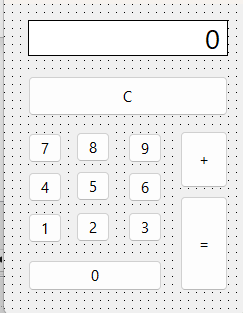

# Pascal: Calculadora Estándar Interactiva con Persistencia de Estados y Control de Eventos

Este repositorio contiene un proyecto práctico de escritorio desarrollado en **Pascal** utilizando el entorno **Lazarus / Delphi** enfocado en el paradigma de la programación dirigida por eventos y la manipulación de estados asíncronos en memoria RAM. La aplicación implementa una interfaz gráfica de usuario (GUI) clásica para una calculadora matemática estándar, administrando flujos de entrada mediante la concatenación dinámica de caracteres y resolviendo operaciones aritméticas mediante almacenamiento acumulativo en variables auxiliares globales.

---

## 📊 Interfaz Gráfica de la Aplicación

Para documentar tu interfaz y la disposición de la grilla de botones, guarda la captura de pantalla de tu formulario en la raíz del repositorio con el nombre exacto de `interfaz_calculadora.png`:



---

## ⚙️ Arquitectura de Software y Lógica del Sistema

El archivo fuente en `src/Unit1.pas` destaca por la sincronización precisa de sus componentes funcionales y eventos:

### 1. Motor de Captura y Concatenación de Streams (`Concat`)
Cada botón numérico ($0 \dots 9$) intercepta la acción del operador de manera aislada e invoca de manera atómica el procedimiento encargado de leer el valor actual del visor e inyectar el nuevo dígito al final de la secuencia utilizando funciones integradas de manipulación de hilos:
```pascal
procedure TForm1.bnt1Click(Sender: TObject);
begin
  lblDisplay.Caption := Concat(lblDisplay.Caption, bnt1.Caption);
end;

```

### 2. Persistencia de Estados en Operaciones Binarias (`btnSumaClick`)

Al activar el operador aritmético de adición, el sistema resguarda de manera temporal el estado del visor (casteándolo de texto a entero binario mediante `StrToInt`) dentro del casillero de memoria global `var_auxiliar` y blanquea el visor gráfico para la captura del segundo operando:

```pascal
procedure TForm1.bntSumaClick(Sender: TObject);
begin
  var_auxiliar := StrToInt(lblDisplay.Caption);
  lblDisplay.Caption := '0'; // Inicialización del visor
end;
```
### 3. Version V2 - Para calculadora
```pascal
var
  Form1: TForm1;
  var_auxiliar: integer;
implementation

{$R *.lfm}


{ TForm1 }


procedure TForm1.bnt1Click(Sender: TObject);
begin
   if lblDisplay.Caption = '0' then
    lblDisplay.Caption := '1'
   else
    lblDisplay.Caption := Concat(lblDisplay.Caption, bnt1.Caption);
end;

procedure TForm1.bnt0Click(Sender: TObject);
begin
    lblDisplay.Caption := '0';
    lblDisplay.Caption := Concat(lblDisplay.Caption, bnt1.Caption);
end;

procedure TForm1.bnt2Click(Sender: TObject);
begin
   if lblDisplay.Caption = '0' then
    lblDisplay.Caption := '2'
   else
    lblDisplay.Caption := Concat(lblDisplay.Caption, bnt2.Caption);
end;

procedure TForm1.bnt3Click(Sender: TObject);
begin
   if lblDisplay.Caption = '0' then
    lblDisplay.Caption := '3'
   else
    lblDisplay.Caption := Concat(lblDisplay.Caption, bnt3.Caption);
end;

procedure TForm1.bnt4Click(Sender: TObject);
begin
   if lblDisplay.Caption = '0' then
    lblDisplay.Caption := '4'
   else
    lblDisplay.Caption := Concat(lblDisplay.Caption, bnt4.Caption);
end;

procedure TForm1.bnt5Click(Sender: TObject);
begin
   if lblDisplay.Caption = '0' then
    lblDisplay.Caption := '5'
   else
    lblDisplay.Caption := Concat(lblDisplay.Caption, bnt5.Caption);
end;

procedure TForm1.bnt6Click(Sender: TObject);
begin
   if lblDisplay.Caption = '0' then
    lblDisplay.Caption := '6'
   else
    lblDisplay.Caption := Concat(lblDisplay.Caption, bnt6.Caption);
end;

procedure TForm1.bnt7Click(Sender: TObject);
begin
   if lblDisplay.Caption = '0' then
    lblDisplay.Caption := '7'
   else
    lblDisplay.Caption := Concat(lblDisplay.Caption, bnt7.Caption);
end;

procedure TForm1.bnt8Click(Sender: TObject);
begin
   if lblDisplay.Caption = '0' then
    lblDisplay.Caption := '8'
   else
    lblDisplay.Caption := Concat(lblDisplay.Caption, bnt8.Caption);
end;

procedure TForm1.bnt9Click(Sender: TObject);
begin
   if lblDisplay.Caption = '0' then
    lblDisplay.Caption := '9'
   else
    lblDisplay.Caption := Concat(lblDisplay.Caption, bnt9.Caption);
end;

procedure TForm1.bntCClick(Sender: TObject);
begin
  lblDisplay.Caption:= '0';
  var_auxiliar:= 0;
end;

procedure TForm1.bntIgualClick(Sender: TObject);
begin
  var_auxiliar:= StrToInt(lblDisplay.Caption) + var_auxiliar;
  lblDisplay.Caption:= IntToStr(var_auxiliar);
end;

procedure TForm1.bntSumaClick(Sender: TObject);
begin
  var_auxiliar:= StrToInt(lblDisplay.Caption);
  lblDisplay.Caption:= '0';
end;

end.      

```

### 3. Cierre del Ciclo de Ejecución y Adición Acumulativa (`bntIgualClick`)

El disparador de igualdad ejecuta el cálculo matemático final combinando el valor persistente con el stream actual del visor, mutando el contenido del acumulador y devolviendo el resultado tras un proceso inverso de casteo numérico a texto (`IntToStr`):

```pascal
procedure TForm1.bntIgualClick(Sender: TObject);
begin
  var_auxiliar := StrToInt(lblDisplay.Caption) + var_auxiliar;
  lblDisplay.Caption := IntToStr(var_auxiliar);
end;

```

---

## 🛠️ Conceptos Técnicos Aplicados

* **Paradigma de Programación Dirigida por Eventos**: Arquitectura en la que los flujos de ejecución son determinados secuencialmente por las acciones del usuario (clics en la GUI) sobre punteros y escuchas activas del entorno.
* **Persistencia por Variables de Estado Auxiliares**: Uso de variables globales reservadas en memoria RAM encargadas de sostener la integridad de los datos de manera transversal a lo largo del ciclo de vida asíncrono de los formularios.
* **Casteo Explícito de Datos Homogéneos**: Rutinas estrictas de conversión mutua (`StrToInt` / `IntToStr`) necesarias para cruzar variables tipadas de naturaleza gráfica con operaciones aritméticas puras de bajo nivel.
